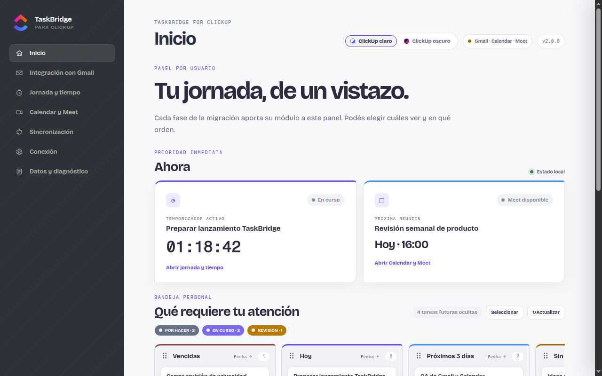

# TaskBridge for ClickUp

> 🤖 **Built with AI**: This extension was developed by [**Leandro Iramain**](https://leandroiramain.com.ar) with the assistance of AI.

A Chrome and Firefox extension that connects Gmail, Google Meet, and ClickUp for task creation, linking, and time tracking. Google Calendar is visible as an integration under development but is not available at runtime.


---



## What's New in v2.2.0

- **ClickUp token-only authentication** - Chrome and Firefox use validated personal tokens without requesting an OAuth Client Secret.
- **Safe legacy migration** - Existing personal tokens remain available; retired OAuth sessions require an explicit personal-token reconnect.
- **Narrower Firefox permissions** - Firefox no longer requests `identity` while Calendar remains disabled.

### Also included from v2.1.0

- **Native Gmail integration** - InboxSDK remnants are removed from source and release artifacts.
- **Broader attachments** - Explicitly select supported images, PDF, Office, text, ZIP, and RAR files from individual thread messages.
- **Inline image discovery** - Gmail-hosted body images appear as selectable attachments with an optional lazy thumbnail view.
- **Reliable linked tasks** - Deleted or unlinked ClickUp tasks are revalidated and removed from the Gmail bar promptly.
- **Optional tracked time** - Empty tracked-time input no longer blocks task creation.

Meet Priority remains opt-in and off by default. Calendar access is read-only and limited to events owned by the signed-in Google account. The extension does not request audio, video, microphone, camera, capture, participant, chat, captions, history, or notification permissions.


---

## ✨ Features

### Core
- **Create Tasks from Gmail** - Add emails to ClickUp with one click
- **Attach to Existing** - Link emails to existing tasks
- **Smart Defaults** - Auto-fills dates, assignee, and location
- **Priority Selector** - Set task priority (Urgent/High/Normal/Low)
- **WYSIWYG Editor** - Rich text description with markdown support
- **Success Popup** - Quick link to view created task
- **Task Search** - Find tasks by ID, URL, or name

### Time Tracking
- **Timer Controls** - Start/stop timer from popup
- **Manual Entry** - Log time with ClickUp format (1h, 30m, 1:30)
- **Recent Entries** - View 7-day time history
- **Auto-Start** - Automatically start timer when opening a task on ClickUp.com
- **Auto-Stop** - Stop when another ClickUp task is opened or the last tab representing the running task is closed
- **Toggle Settings** - Enable/disable auto-tracking per preference
- **Google Meet Priority** - Optionally link a confirmed Meet session to a ClickUp task without capturing meeting content
- **Google Calendar Agenda** - Planned read-only integration, currently in development and unavailable
- **Work Schedule** - Configure workdays and daily/weekly hour goals

### Performance
- **List Cache** - Pre-load all spaces/folders/lists for instant modal loading
- **Stale-While-Revalidate** - Use cached data while refreshing in background

### Sync & Migration
- **Email Tasks Sync** - Sync existing email-task links when migrating PC/browser
- **Thread ID Tracking** - Email links stored in task description for efficient sync
- **Sanitized Email HTML Attachment** - Attach a sanitized HTML snapshot of the email to ClickUp tasks
- **Explicit Gmail Attachments** - Select supported Gmail-hosted body images, documents, spreadsheets, presentations, text files, or archives with per-file and per-operation limits

---

## 🔐 Security

This extension reduces common local-extension risks but is not a security boundary against a compromised browser profile, machine, or malicious extension. ClickUp personal-token storage uses Web Crypto helpers to reduce accidental exposure, not to provide absolute protection if the local profile is compromised. Google Calendar OAuth remains browser-managed in Chrome.

| Feature | Description |
|---------|-------------|
| **Local token handling** | Personal ClickUp tokens are validated before encrypted local persistence; Google Calendar tokens remain browser-managed |
| **Production-safe logger** | Debug and sensitive payload logging is suppressed in normal builds |
| **Message validation** | Runtime messages are checked by sender origin and expected shape |
| **Sanitized Gmail HTML** | Email HTML is sanitized before being attached or rendered through extension flows |
| **Narrower permissions** | Runtime hosts are limited to Gmail, ClickUp API/app, Meet, and Google APIs required by the read-only Calendar scope |
| **Meet data minimization** | Persistent mappings contain only a namespaced SHA-256 room hash and ClickUp metadata; a sanitized visible title is session-only and multimedia or meeting content is not captured |
| **Trusted local storage** | Host content scripts cannot read extension local storage directly |
| **No analytics** | No telemetry or analytics code is included |

See [SECURITY.md](SECURITY.md) for vulnerability reporting.

---

## 🛠️ Tech Stack

- **TypeScript** - 100% typed codebase
- **Manifest V3** - Modern Chrome extension format
- **esbuild** - Fast bundling
- **Jest** - local unit/integration-style tests for hardening-critical paths
- **GitHub Actions** - CI/CD pipeline

---

## 📖 Documentation

| Document | Description |
|----------|-------------|
| [User Guide](USER_GUIDE.md) | Usage guide for v2.0 |
| [Technical Docs](TECHNICAL_DOCS.md) | Current architecture and security boundaries |
| [Changelog](CHANGELOG.md) | Version history and changes |
| [Contributing](CONTRIBUTING.md) | How to contribute |
| [Security](SECURITY.md) | Security policy |
| [Privacy Policy](PRIVACY_POLICY.md) | Data use and permission disclosure |
| [Wiki](https://github.com/Diramain/taskbridge-for-clickup/wiki) | Online documentation |

---

## 📦 Installation

### From Chrome Web Store

Use the [TaskBridge for ClickUp listing](https://chromewebstore.google.com/detail/gihebfjgjfnglhadpeemhpdoamklckdg) when the Store version is available for your account.

### From GitHub Release

1. Download the latest release from [Releases](https://github.com/Diramain/taskbridge-for-clickup/releases)
2. Extract the ZIP file
3. Go to `chrome://extensions`
4. Enable "Developer mode"
5. Click "Load unpacked"
6. Select the extracted folder

### From Source

```bash
# Clone the repo
git clone https://github.com/Diramain/taskbridge-for-clickup.git
cd taskbridge-for-clickup

# Install dependencies
npm install

# Build
npm run build

# Build and validate the Chrome and Firefox release candidates
npm run build:release
npm run validate:release

# Run tests
npm test

# Load in Chrome
# 1. Go to chrome://extensions
# 2. Enable "Developer mode"
# 3. Click "Load unpacked"
# 4. Select dist/chrome
```

`npm run build:release` creates isolated `dist/chrome` and `dist/firefox`
directories plus versioned ZIP files and SHA-256 hashes under `dist/artifacts`.
Target-specific commands are available as `build:release:chrome` and
`build:release:firefox`. The Firefox package remains a migration candidate and
must not be submitted to AMO until the Firefox functional and security gates
are complete. Legacy shell packaging scripts are not supported.

---

## ⚙️ Configuration

1. Open [ClickUp API settings](https://app.clickup.com/settings/apps) and generate your own personal token.
2. Click the extension icon, paste the token under **Conexión rápida**, and connect. The token is validated before encrypted local persistence and is never saved as a draft.
3. Select your preferred workspace (optional).
4. Google Calendar appears as **In development** and cannot be connected in the current release.
5. To use Meet Priority, enable **Detectar sesiones Google Meet** and choose a task when a confirmed session is detected.

Use one personal token per ClickUp user. Do not share a workspace-wide token. ClickUp OAuth configuration inside the extension is no longer supported; upgrades remove legacy OAuth configuration and require a personal-token reconnect without disconnecting users who already have a valid personal token.

Chrome 102 or newer is required. Meet Priority is off by default and the extension is not allowed in incognito mode.

---

## 📁 Project Structure

```
taskbridge-for-clickup/
├── manifest.json          # Chrome MV3 manifest
├── background.ts          # Service worker (ClickUp API)
├── src/
│   ├── services/          # API, Auth, Crypto, Storage, Timer
│   ├── clickup-tracker.ts # Auto time tracking on ClickUp.com
│   ├── calendar/          # Read-only agenda, event cache, mappings, and Calendar runtime
│   ├── meet/              # Minimal Meet detector, private room identity, and priority state
│   ├── gmail-native.ts    # Gmail DOM integration
│   ├── gmail-adapter.ts   # DOM abstraction layer
│   ├── modal.ts           # Task creation modal
│   ├── logger.ts          # Structured logging
│   └── types/             # TypeScript definitions
├── app/                   # Responsive full-tab application
├── popup/                 # Minimal launcher plus durable setup surface
├── styles/
│   └── modal.css
├── tests/                 # Jest suites for service, UI, privacy, and release checks
└── .github/workflows/     # CI/CD pipeline
```

---

## 🔧 Architecture

```
┌─────────────────────────────────────────────────────────────┐
│                        Gmail Page                            │
├─────────────────────────────────────────────────────────────┤
│  gmail-native.ts → gmail-adapter.ts → DOM                   │
│       ↓                                                      │
│  modal.ts (Task Creation UI)                                │
│       ↓                                                      │
│  chrome.runtime.sendMessage()                               │
└─────────────────────────────────────────────────────────────┘
                           ↓
┌─────────────────────────────────────────────────────────────┐
│                   background.ts (Service Worker)            │
├─────────────────────────────────────────────────────────────┤
│  ClickUpAPIWrapper                                          │
│  - Validated personal-token authentication                  │
│  - Validate before encrypted credential persistence         │
│  - API retry, rate governor, and bounded timeout             │
│  - Explicit reconnection after confirmed authentication loss │
│  - Task CRUD, Time Tracking                                 │
└─────────────────────────────────────────────────────────────┘
                           ↓
┌─────────────────────────────────────────────────────────────┐
│                   ClickUp API v2                            │
└─────────────────────────────────────────────────────────────┘
```

---

## 🧪 Testing

```bash
# Run all tests
npm test

# Run tests in watch mode
npm test -- --watch

# Run with coverage
npm test -- --coverage
```

The local baseline includes typecheck, Jest, normal build, release build, release validation, and whitespace diff checks.

---

## 📄 License

[MIT License](LICENSE) - Free and Open Source

---

## 🙏 Credits

- **Leandro Iramain** ([website](https://leandroiramain.com.ar), [@diramain](https://github.com/Diramain)) - Author / Product Manager
- **AI-assisted engineering tools** - Development and review support
- **ClickUp API** - Task management platform

---

## 📢 Disclaimer

> **Nota del autor:**
> 
> Soy **Product Manager, no desarrollador**. Reconozco mis limitaciones técnicas y este proyecto fue creado enteramente con asistencia de IA para resolver una necesidad personal de integración entre Gmail y ClickUp.
> 
> **Invito a cualquier desarrollador** a usar, mejorar, y contribuir a este código sin necesidad de pedir permiso. Solo respeta la licencia MIT.
> 
> Este proyecto fue hecho para uso personal, no con fines comerciales. Si te resulta útil, ¡genial! Si puedes mejorarlo, ¡aún mejor!

---

<p align="center">
  Built with AI assistance by a Product Manager
</p>
