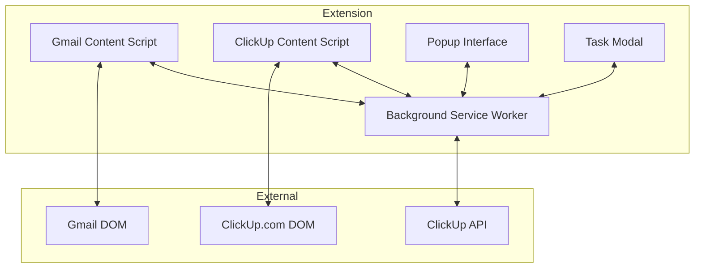
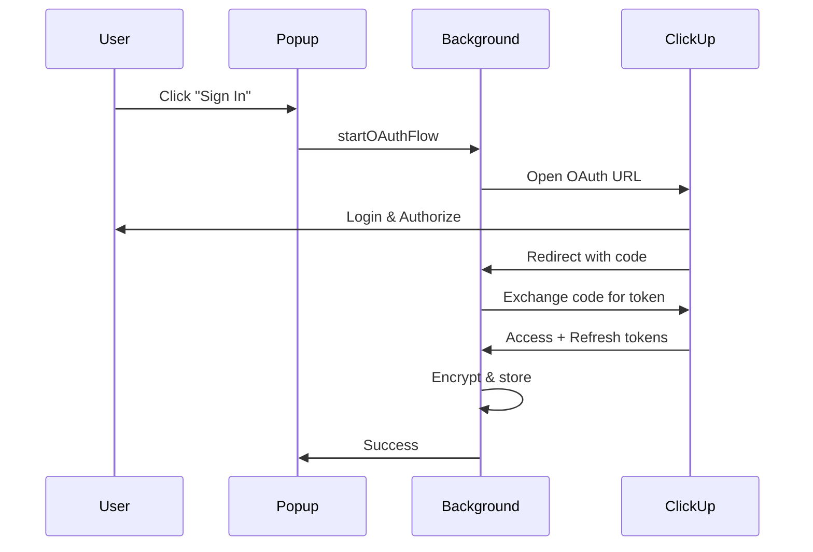
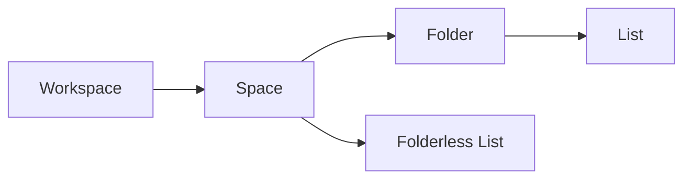

# ClickUp Gmail Chrome Extension
## Technical Documentation v1.1

**Author:** Leandro Iramain  
**Date:** January 2026  
**Version:** 1.1.0

---

# Table of Contents

1. [Overview](#overview)
2. [Architecture](#architecture)
3. [Security Features](#security-features)
4. [Core Services](#core-services)
5. [Content Scripts](#content-scripts)
6. [Popup Interface](#popup-interface)
7. [Task Modal](#task-modal)
8. [API Integration](#api-integration)
9. [Data Storage](#data-storage)
10. [Build System](#build-system)
11. [Testing](#testing)
12. [CI/CD](#cicd)

---

# Overview

ClickUp Gmail Chrome Extension is a browser extension that seamlessly integrates ClickUp project management with Gmail. It allows users to:

- Create ClickUp tasks directly from Gmail emails
- Link emails to existing tasks
- Track time on tasks
- View linked tasks within Gmail
- Auto-start/stop timers when viewing tasks in ClickUp

## Key Features

| Feature | Description |
|---------|-------------|
| **Task Creation** | Create tasks from emails with full description, assignees, dates |
| **Email Linking** | Bi-directional link between Gmail threads and ClickUp tasks |
| **Time Tracking** | Start/stop timers, manual time entry, auto-tracking |
| **Rich Text Editor** | Full markdown support with bold, italic, code, lists |
| **File Attachments** | Attach email content as HTML files to tasks |
| **Hierarchy Browser** | Navigate Workspace → Space → Folder → List |
| **Inbox Scanning** | Badge display for emails with linked tasks |

---

# Architecture

## System Overview



## Component Architecture

### 1. Background Service Worker (`background.ts`)
**Location:** `/background.ts`  
**Size:** 34KB  
**Lines:** ~950

The central hub that handles all business logic:

- OAuth token management
- API communication with ClickUp
- Message routing between components
- Context menu integration
- Badge updates
- Data caching

### 2. Gmail Content Script (`gmail-native.ts`)
**Location:** `/src/gmail-native.ts`  
**Size:** 21KB

Injected into Gmail pages to:

- Detect email views
- Inject ClickUp bar UI
- Scan inbox for linked tasks
- Handle task creation modal
- Display task badges

### 3. ClickUp Content Script (`clickup-tracker.ts`)
**Location:** `/src/clickup-tracker.ts`  
**Size:** 9KB

Injected into ClickUp.com to:

- Auto-start timers when viewing tasks
- Auto-stop timers when leaving task views
- Detect task navigation via URL changes

### 4. Popup Interface (`popup/`)
**Location:** `/popup/`

Three-tab interface:
- **Tasks Tab:** Search and create tasks
- **Tracking Tab:** Timer controls and time history
- **Config Tab:** Settings, sync, data management

### 5. Task Modal (`src/modal.ts`)
**Location:** `/src/modal.ts`  
**Size:** 59KB

Full-featured task creation modal with:
- Rich text editor
- Hierarchy browser
- Assignee selection
- Date pickers
- Priority selection
- File attachments

---

# Security Features

## 🔐 SEC-C1: Encrypted OAuth Credentials

**Location:** `/src/services/crypto.service.ts`

The OAuth client secret is encrypted at rest using AES-256-GCM:

```typescript
// Encryption algorithm
const ALGORITHM: AesGcmParams = {
    name: 'AES-GCM',
    length: 256
};

// Key generation
async function generateEncryptionKey(): Promise<CryptoKey> {
    return crypto.subtle.generateKey(
        ALGORITHM,
        true,
        ['encrypt', 'decrypt']
    );
}
```

### How It Works

1. **Key Generation:** A 256-bit AES key is generated on first use
2. **Key Storage:** The key is stored in `chrome.storage.local` (base64 encoded)
3. **Encryption:** Client secret is encrypted with random IV
4. **Storage Format:** `{ iv: string, ciphertext: string }`

### Functions

| Function | Description |
|----------|-------------|
| `encryptToken(token)` | Encrypts a string using AES-256-GCM |
| `decryptToken(encrypted)` | Decrypts an encrypted token object |
| `saveSecureToken(key, token)` | Encrypts and saves to storage |
| `getSecureToken(key)` | Retrieves and decrypts from storage |
| `saveSecureOAuthConfig(config)` | Saves OAuth config with encrypted secret |
| `getSecureOAuthConfig()` | Retrieves and decrypts OAuth config |

### Migration

Legacy plain-text tokens are automatically migrated:

```typescript
// Auto-migration on first access
const plainToken = await chrome.storage.local.get('accessToken');
if (plainToken.accessToken && typeof plainToken.accessToken === 'string') {
    await saveSecureToken('accessToken', plainToken.accessToken);
    // Plain text is removed after migration
}
```

---

## 🔐 SEC-H1: Secure Token Storage

All sensitive tokens are encrypted:

| Token | Storage Key | Encryption |
|-------|-------------|------------|
| Access Token | `secure_accessToken` | AES-256-GCM |
| Refresh Token | `secure_refreshToken` | AES-256-GCM |
| Client Secret | `secure_oauthConfig` | AES-256-GCM |

---

## 🔐 SEC-M3: Production-Safe Logging

**Location:** `/src/logger.ts`

The logger has a `PRODUCTION` flag that suppresses info/debug logs:

```typescript
static PRODUCTION = false; // Set to true for production builds

static info(message: string, ...args: any[]): void {
    if (this.PRODUCTION) return; // Suppress in production
    // ... logging logic
}
```

### Log Levels

| Level | Production | Description |
|-------|------------|-------------|
| DEBUG | ❌ Suppressed | Detailed debug info |
| INFO | ❌ Suppressed | General information |
| WARN | ✅ Shown | Warning messages |
| ERROR | ✅ Shown | Error messages |

---

## 🔐 Permission Model

**Location:** `/manifest.json`

### Required Permissions

```json
{
    "permissions": [
        "storage",      // For encrypted token storage
        "identity",     // For OAuth flow
        "contextMenus", // Right-click menu integration
        "tabs"          // Tab communication
    ]
}
```

### Host Permissions

```json
{
    "host_permissions": [
        "https://api.clickup.com/*",   // API calls
        "https://mail.google.com/*",   // Gmail integration
        "https://*.clickup.com/*"      // ClickUp.com integration
    ]
}
```

### Security Principle: Least Privilege

The extension only requests permissions that are absolutely necessary:
- No `<all_urls>` permission
- No `webRequest` permission
- No background page (uses service worker)

---

# Core Services

## 1. API Service (`api.service.ts`)

**Location:** `/src/services/api.service.ts`  
**Size:** 13KB  
**Lines:** ~385

### Class: `ClickUpAPIWrapper`

Central class for all ClickUp API communication.

### Constructor

```typescript
constructor(accessToken: string, onTokenRefresh?: () => Promise<string | null>)
```

| Parameter | Description |
|-----------|-------------|
| `accessToken` | Initial OAuth access token |
| `onTokenRefresh` | Callback for token refresh on 401 |

### Key Methods

#### Authentication & User

| Method | Returns | Description |
|--------|---------|-------------|
| `getUser()` | `User` | Get authenticated user info |
| `getTeams()` | `Team[]` | Get user's workspaces |

#### Hierarchy

| Method | Parameters | Returns | Description |
|--------|------------|---------|-------------|
| `getSpaces(teamId)` | Team ID | `Space[]` | Get spaces in workspace |
| `getFolders(spaceId)` | Space ID | `Folder[]` | Get folders in space |
| `getLists(folderId)` | Folder ID | `List[]` | Get lists in folder |
| `getFolderlessLists(spaceId)` | Space ID | `List[]` | Get lists without folder |

#### Tasks

| Method | Parameters | Returns | Description |
|--------|------------|---------|-------------|
| `createTask(listId, payload)` | List ID, task data | `Task` | Create new task |
| `getTask(taskId)` | Task ID | `Task` | Get task by ID |
| `searchTasks(teamId, query)` | Team ID, search query | `Task[]` | Search tasks |
| `getTaskComments(taskId)` | Task ID | `Comment[]` | Get task comments |

#### Time Tracking

| Method | Parameters | Returns | Description |
|--------|------------|---------|-------------|
| `startTimer(teamId, taskId)` | IDs | `Timer` | Start timer on task |
| `stopTimer(teamId)` | Team ID | `Timer` | Stop running timer |
| `getRunningTimer(teamId)` | Team ID | `Timer|null` | Get current timer |
| `getTimeEntries(teamId, start?, end?)` | IDs, dates | `TimeEntry[]` | Get time entries |
| `createTimeEntry(teamId, taskId, duration)` | IDs, duration | `TimeEntry` | Add manual entry |

#### Attachments & Comments

| Method | Parameters | Returns | Description |
|--------|------------|---------|-------------|
| `addComment(taskId, text)` | Task ID, markdown | `Comment` | Add comment |
| `uploadAttachment(taskId, content, name)` | Task ID, file | `Attachment` | Upload file |

### Error Handling

```typescript
private async request<T>(endpoint: string, options?: RequestInit): Promise<T> {
    // Retry logic with exponential backoff
    for (let attempt = 0; attempt < 3; attempt++) {
        const response = await fetch(url, options);
        
        if (response.status === 401) {
            // Try token refresh
            const newToken = await this.onTokenRefresh?.();
            if (newToken) {
                this.accessToken = newToken;
                continue; // Retry with new token
            }
        }
        
        if (response.status === 429) {
            // Rate limited - wait and retry
            await sleep(1000 * (attempt + 1));
            continue;
        }
        
        return response.json();
    }
}
```

---

## 2. Auth Service (`auth.service.ts`)

**Location:** `/src/services/auth.service.ts`  
**Size:** 8KB

### Class: `AuthService`

Manages OAuth authentication flow.

### Key Methods

| Method | Description |
|--------|-------------|
| `getStatus()` | Check if user is authenticated |
| `saveOAuthConfig(config)` | Save encrypted OAuth credentials |
| `getOAuthConfig()` | Retrieve decrypted OAuth credentials |
| `startOAuthFlow()` | Initiate OAuth popup flow |
| `refreshToken()` | Refresh expired access token |
| `getAccessToken()` | Get current access token |
| `logout()` | Clear all auth data |

### OAuth Flow



---

## 3. Crypto Service (`crypto.service.ts`)

**Location:** `/src/services/crypto.service.ts`  
**Size:** 8KB

### Functions (Detailed)

#### `generateEncryptionKey()`
Generates a new AES-256-GCM key for encryption.

```typescript
async function generateEncryptionKey(): Promise<CryptoKey> {
    return crypto.subtle.generateKey(
        { name: 'AES-GCM', length: 256 },
        true,
        ['encrypt', 'decrypt']
    );
}
```

#### `getOrCreateEncryptionKey()`
Retrieves existing key or creates new one.

```typescript
async function getOrCreateEncryptionKey(): Promise<CryptoKey> {
    const stored = await chrome.storage.local.get(KEY_STORAGE_KEY);
    
    if (stored[KEY_STORAGE_KEY]) {
        // Import existing key
        const keyData = base64ToBuffer(stored[KEY_STORAGE_KEY]);
        return crypto.subtle.importKey('raw', keyData, 'AES-GCM', true, ['encrypt', 'decrypt']);
    }
    
    // Generate and store new key
    const key = await generateEncryptionKey();
    const exported = await crypto.subtle.exportKey('raw', key);
    await chrome.storage.local.set({ [KEY_STORAGE_KEY]: bufferToBase64(exported) });
    return key;
}
```

#### `encryptToken(token: string)`
Encrypts a token using AES-256-GCM.

```typescript
async function encryptToken(token: string): Promise<EncryptedData> {
    const key = await getOrCreateEncryptionKey();
    const iv = crypto.getRandomValues(new Uint8Array(12)); // 96-bit IV
    const encoded = new TextEncoder().encode(token);
    
    const ciphertext = await crypto.subtle.encrypt(
        { name: 'AES-GCM', iv },
        key,
        encoded
    );
    
    return {
        iv: bufferToBase64(iv),
        ciphertext: bufferToBase64(ciphertext)
    };
}
```

#### `decryptToken(encrypted: EncryptedData)`
Decrypts an encrypted token.

```typescript
async function decryptToken(encrypted: EncryptedData): Promise<string> {
    const key = await getOrCreateEncryptionKey();
    const iv = base64ToBuffer(encrypted.iv);
    const ciphertext = base64ToBuffer(encrypted.ciphertext);
    
    const decrypted = await crypto.subtle.decrypt(
        { name: 'AES-GCM', iv },
        key,
        ciphertext
    );
    
    return new TextDecoder().decode(decrypted);
}
```

---

## 4. Storage Service (`storage.service.ts`)

**Location:** `/src/services/storage.service.ts`  
**Size:** 10KB

### Class: `StorageService`

Abstraction layer for `chrome.storage.local` with advanced features:

- Schema versioning
- TTL (Time-to-Live) for cached data
- Data limits
- Automatic cleanup

### Storage Schema

```typescript
interface StorageSchema {
    // Auth
    secure_accessToken: EncryptedData;
    secure_refreshToken: EncryptedData;
    secure_oauthConfig: EncryptedData;
    
    // User Data
    cachedUser: User;
    cachedTeams: { teams: Team[], timestamp: number };
    preferredTeamId: string;
    
    // Settings
    autoStartTimer: boolean;
    autoStopTimer: boolean;
    useCustomFieldForThreadId: boolean;
    threadIdField: string;
    
    // Cache
    hierarchyCache: HierarchyData;
    emailTaskMappings: Record<string, TaskMapping>;
}
```

### Key Methods

| Method | Description |
|--------|-------------|
| `get(key)` | Get value with type safety |
| `set(key, value)` | Set value with validation |
| `remove(key)` | Remove single key |
| `clear()` | Clear all extension data |
| `getWithTTL(key, ttl)` | Get with expiration check |
| `setWithTTL(key, value, ttl)` | Set with timestamp |

### Data Limits

```typescript
const DATA_LIMITS = {
    MAX_EMAIL_TASK_MAPPINGS: 1000,
    MAX_CACHED_TASKS_AGE_DAYS: 90,
    MAX_HIERARCHY_CACHE_AGE_MS: 24 * 60 * 60 * 1000 // 24 hours
};
```

---

## 5. Timer Service (`timer.service.ts`)

**Location:** `/src/services/timer.service.ts`  
**Size:** 7KB

### Class: `TimerService`

Manages time tracking functionality.

### Key Methods

| Method | Parameters | Description |
|--------|------------|-------------|
| `startTimer(teamId, taskId)` | IDs | Start timer on task |
| `stopTimer(teamId)` | Team ID | Stop running timer |
| `getRunningTimer(teamId)` | Team ID | Get current timer |
| `addManualEntry(teamId, taskId, duration)` | IDs, ms | Add manual time |
| `getRecentEntries(teamId, days)` | Team ID, days | Get recent entries |

### Timer State Management

```typescript
interface TimerState {
    isRunning: boolean;
    currentTaskId: string | null;
    startTime: number | null;
}
```

---

# Content Scripts

## 1. Gmail Content Script (`gmail-native.ts`)

### Injection Points

The script is injected at `document_idle` on Gmail pages.

### Key Classes

#### `GmailAdapter`

Adapts the Gmail DOM for the extension:

```typescript
class GmailAdapter {
    getThreadId(): string | null;
    getEmailSubject(): string;
    getEmailSender(): string;
    getEmailBody(): string;
    getEmailHtml(): string;
    isEmailView(): boolean;
    getHeaderContainer(): Element | null;
}
```

### UI Components

#### ClickUp Bar

Injected below email header:

```html
<div class="cu-email-bar">
    <button class="cu-add-btn">➕ Add to ClickUp</button>
    <div class="cu-linked-tasks">
        <!-- Linked task badges -->
    </div>
</div>
```

#### Inbox Badges

Task count badges displayed next to email subjects in inbox view:

```html
<span class="cu-inbox-task-badge">
    <a class="cu-inbox-task-link" href="...">CU-abc123</a>
</span>
```

### Event Handling

```typescript
// DOM mutation observer for SPA navigation
const observer = new MutationObserver((mutations) => {
    if (isEmailView()) {
        injectClickUpBar();
    }
});

// URL change detection
window.addEventListener('popstate', handleNavigation);
```

---

## 2. ClickUp Tracker (`clickup-tracker.ts`)

### Purpose

Auto-tracks time when viewing tasks on ClickUp.com.

### URL Detection

```typescript
function getClickupUrlType(url: string): 'task' | 'inbox' | null {
    if (url.includes('/t/')) return 'task';
    if (url.includes('inbox')) return 'inbox';
    return null;
}
```

### Auto-Start Logic

```typescript
async function checkNavigation(): Promise<void> {
    const urlType = getClickupUrlType(location.href);
    
    if (settings.autoStartTimer && urlType === 'task') {
        if (!isTimerRunning() && exists(SELECTORS.TIMER_NOT_RUNNING)) {
            startTimer();
        }
    }
}
```

### Timer Interaction

The script interacts with ClickUp's timer UI by:

1. Finding timer toggle elements via CSS selectors
2. Dispatching click events
3. Handling shadow DOM for ClickUp 4.0

```typescript
const SELECTORS = {
    TIMER_NOT_RUNNING: '.cu-time-tracker-timer-toggle__play-icon',
    TIMER_RUNNING: '.cu-time-tracker-timer-toggle__stop-icon',
    TIMER_TOGGLE: 'cu-time-tracker-timer-toggle-v3'
};
```

---

# Popup Interface

## Structure

```
popup/
├── popup.html    # HTML structure
├── popup.css     # Styles
├── popup.ts      # TypeScript logic
└── tabs/
    ├── tasks.tab.ts
    ├── tracking.tab.ts
    └── config.tab.ts
```

## Tabs

### Tasks Tab

| Component | Function |
|-----------|----------|
| Task Search | Search tasks by name or ID |
| Quick Create | Inline task creation form |
| Full Form | Opens task modal |

### Tracking Tab

| Component | Function |
|-----------|----------|
| Running Timer | Shows current timer with stop button |
| Auto Tracking | Toggle auto-start/stop settings |
| Start Timer | Search and start timer on task |
| Manual Entry | Add time entry manually |
| Recent Entries | Last 10 time entries (7 days) |

### Config Tab

| Component | Function |
|-----------|----------|
| User Info | Display logged-in user |
| Preferred Workspace | Select default workspace |
| Custom Field | Configure thread ID storage |
| List Cache | Sync workspace hierarchy |
| Email Tasks | Sync email-task mappings |
| Data Management | Export/clear data |
| Dev Tools | Test token refresh |

---

# Task Modal

## Features

### Rich Text Editor

Supports the following formatting:

| Format | Shortcut | Markdown |
|--------|----------|----------|
| Bold | Ctrl+B | `**text**` |
| Italic | Ctrl+I | `_text_` |
| Strikethrough | - | `~~text~~` |
| Code | - | `` `code` `` |
| Link | - | `[text](url)` |
| Bullet List | - | `- item` |
| Numbered List | - | `1. item` |
| Quote | - | `> quote` |

### HTML to Markdown Conversion

```typescript
htmlToClickUpMarkdown(html: string): string {
    // Convert <br> to newlines
    temp.querySelectorAll('br').forEach(br => br.replaceWith('\n'));
    
    // Convert formatting
    temp.querySelectorAll('strong, b').forEach(el => {
        el.replaceWith(`**${el.textContent}**`);
    });
    
    temp.querySelectorAll('em, i').forEach(el => {
        el.replaceWith(`_${el.textContent}_`);
    });
    
    // ... more conversions
}
```

### Hierarchy Browser



### Time Tracking in Modal

Users can specify time to track when creating a task:

```typescript
const timeTracked = this.parseTime(
    (this.modal.querySelector('#cu-time-tracked') as HTMLInputElement).value
);

// Sent with task creation
chrome.runtime.sendMessage({
    action: 'createTaskFull',
    taskData: taskData,
    timeTracked: timeTracked,  // Duration in ms
    teamId: this.teamId
});
```

---

# API Integration

## Endpoints Used

| Endpoint | Method | Description |
|----------|--------|-------------|
| `/user` | GET | Get authenticated user |
| `/team` | GET | Get user's teams |
| `/team/{id}/space` | GET | Get spaces in team |
| `/space/{id}/folder` | GET | Get folders in space |
| `/folder/{id}/list` | GET | Get lists in folder |
| `/space/{id}/list` | GET | Get folderless lists |
| `/list/{id}/task` | POST | Create task |
| `/task/{id}` | GET | Get task details |
| `/team/{id}/task` | GET | Search tasks |
| `/task/{id}/comment` | GET/POST | Get/add comments |
| `/task/{id}/attachment` | POST | Upload attachment |
| `/task/{id}/field/{fieldId}` | POST | Set custom field |
| `/team/{id}/time_entries` | GET/POST | Time entries |
| `/team/{id}/time_entries/current` | GET | Running timer |
| `/team/{id}/time_entries/start` | POST | Start timer |
| `/team/{id}/time_entries/stop` | POST | Stop timer |

## Rate Limiting

The extension respects ClickUp's rate limits:

- Retry on 429 with exponential backoff
- Maximum 3 retries per request
- Minimum 1 second between retries

---

# Data Storage

## Storage Keys

| Key | Type | Description |
|-----|------|-------------|
| `secure_accessToken` | EncryptedData | OAuth access token |
| `secure_refreshToken` | EncryptedData | OAuth refresh token |
| `secure_oauthConfig` | EncryptedData | Client ID & encrypted secret |
| `cachedUser` | User | Logged-in user info |
| `cachedTeams` | Object | Teams with timestamp |
| `preferredTeamId` | string | Selected workspace ID |
| `hierarchyCache` | HierarchyData | Workspace hierarchy |
| `emailTaskMappings` | Object | Thread ID → Task mappings |
| `autoStartTimer` | boolean | Auto-start setting |
| `autoStopTimer` | boolean | Auto-stop setting |
| `useCustomFieldForThreadId` | boolean | Thread ID storage method |
| `threadIdField` | string | Custom field name |

## Data Export Format

```json
{
    "emailTaskMappings": {
        "19bc8ca9ffe18fde": {
            "taskId": "86aem6zg0",
            "taskName": "Email Task",
            "taskUrl": "https://app.clickup.com/t/86aem6zg0"
        }
    },
    "hierarchyCache": { ... },
    "preferredTeamId": "90131585972",
    "exportDate": "2026-01-18T22:00:00.000Z",
    "version": "1.0"
}
```

---

# Build System

## Build Script (`build.js`)

**Location:** `/build.js`

Uses esbuild for fast TypeScript compilation:

```javascript
const entryPoints = [
    { in: 'background.ts', out: 'background.js' },
    { in: 'popup/popup.ts', out: 'popup/popup.js' },
    { in: 'src/modal.ts', out: 'src/modal.js' },
    // ... more entry points
];

await esbuild.build({
    entryPoints: entryPoints.map(e => e.in),
    outdir: '.',
    bundle: true,
    format: 'iife',
    platform: 'browser',
    target: 'chrome100',
    sourcemap: true,
    minify: false
});
```

## Build Commands

| Command | Description |
|---------|-------------|
| `node build.js` | Full build with type check |
| `node build.js --skip-typecheck` | Fast build without types |
| `npm run build` | npm wrapper for build |
| `npm run watch` | Watch mode for development |

## Output Files

| Source | Output | Description |
|--------|--------|-------------|
| `background.ts` | `background.js` | Service worker |
| `popup/popup.ts` | `popup/popup.js` | Popup script |
| `src/modal.ts` | `src/modal.js` | Modal script |
| `src/gmail-native.ts` | `src/gmail-native.js` | Gmail content script |
| `src/clickup-tracker.ts` | `src/clickup-tracker.js` | ClickUp content script |

---

# Testing

## Test Framework

- **Framework:** Jest
- **Location:** `/tests/`
- **Config:** `/jest.config.js`

## Test Files

| File | Coverage |
|------|----------|
| `background.test.js` | Helper functions, storage |
| `modal.test.js` | Text parsing, HTML conversion |
| `api.service.test.js` | API wrapper |
| `crypto.test.js` | Encryption/decryption |

## Running Tests

```bash
npm test
npx jest --coverage
```

---

# CI/CD

## GitHub Actions Workflow

**Location:** `.github/workflows/ci.yml`

```yaml
name: CI
on: [push, pull_request]

jobs:
  build:
    runs-on: ubuntu-latest
    steps:
      - uses: actions/checkout@v4
      - uses: actions/setup-node@v4
        with:
          node-version: '20'
      - run: npm ci
      - run: npm run typecheck
      - run: npm test
      - run: npm run build
      - uses: actions/upload-artifact@v4
        with:
          name: extension
          path: |
            *.js
            *.html
            *.json
            popup/
            src/
            styles/
            icons/
```

---

# Appendix

## Type Definitions

**Location:** `/src/types/clickup.d.ts`

Key interfaces:

```typescript
interface Task {
    id: string;
    name: string;
    description?: string;
    markdown_description?: string;
    status: Status;
    priority?: Priority;
    assignees: User[];
    due_date?: number;
    start_date?: number;
    time_estimate?: number;
    url: string;
    // ... more fields
}

interface TimeEntry {
    id: string;
    task: Task;
    wid: string;
    user: User;
    duration: number;
    start: number;
    end?: number;
}

interface EmailData {
    threadId: string;
    subject: string;
    sender: string;
    body?: string;
    html?: string;
}
```

## Constants

**Location:** `/src/constants.ts`

```typescript
export const CONSTANTS = {
    API_BASE_URL: 'https://api.clickup.com/api/v2',
    
    // Timeouts
    SEARCH_DEBOUNCE_MS: 300,
    TOAST_DURATION_MS: 3000,
    
    // Limits
    MAX_SEARCH_RESULTS: 50,
    MAX_LIST_RESULTS: 20,
    MAX_TIME_ENTRIES: 50,
    
    // Cache TTL
    SEARCH_CACHE_TTL_MS: 5 * 60 * 1000,      // 5 min
    TASK_CACHE_TTL_MS: 30 * 60 * 1000,       // 30 min
    HIERARCHY_CACHE_TTL_MS: 24 * 60 * 60 * 1000, // 24 hr
    
    // Storage keys
    STORAGE_KEYS: {
        ACCESS_TOKEN: 'secure_accessToken',
        REFRESH_TOKEN: 'secure_refreshToken',
        OAUTH_CONFIG: 'secure_oauthConfig',
        // ... more keys
    }
};
```

---

## Version History

| Version | Date | Changes |
|---------|------|---------|
| 1.1.0 | Jan 2026 | Bug fixes: Rich text line breaks, time tracking on task creation, thread ID in description, auto-start via URL, recent entries refresh. Added toggle saved feedback. |
| 1.0.0 | Jan 2026 | Initial release |

---

**End of Documentation**
